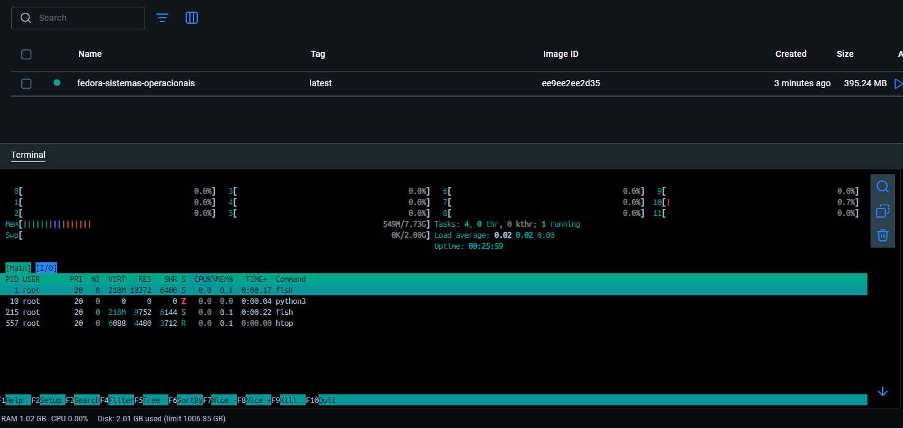
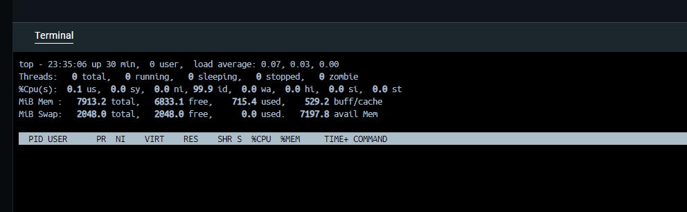
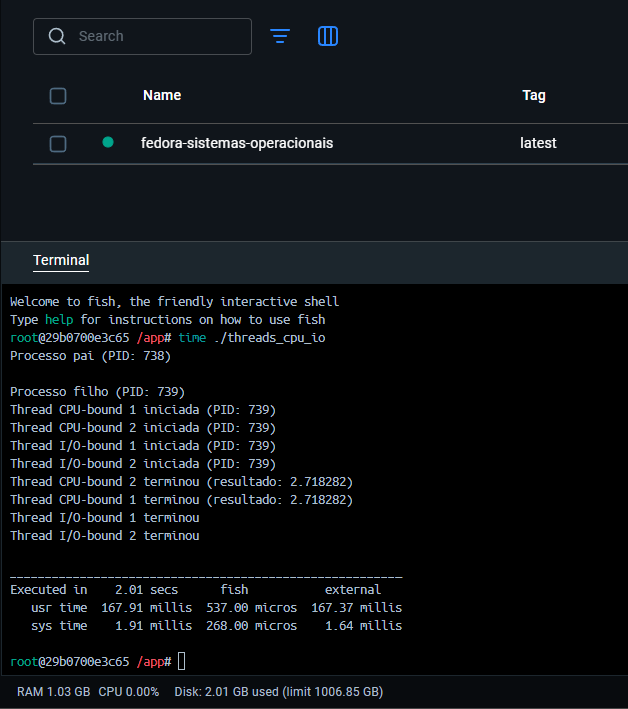
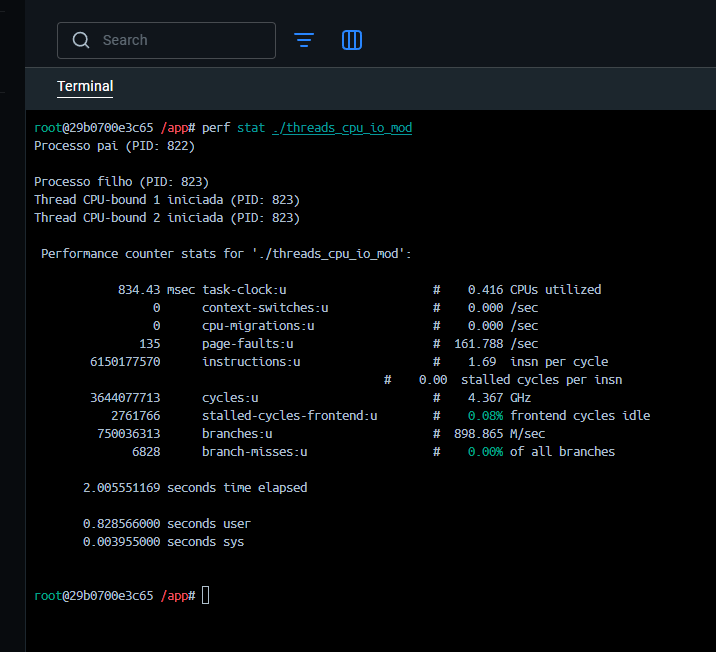
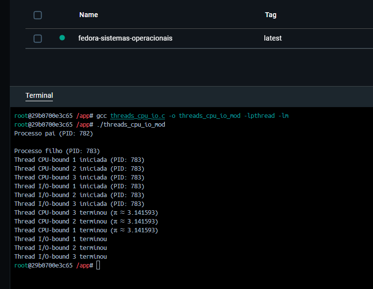

# Relatório de Escalonamento de Tarefas - Atividade 04

## Informações Gerais

- disciplina: **SO** [Sistemas Operacionais](https://github.com/sistemas-operacionais/)
- professor: [Leonardo A. Minora](https://github.com/leonardo-minora)
- aluno: [Nadson Santos Nascimento](https://github.com/nadsuus)
- Data: 12/06/2025

## Sumário

1. [Pré-requisitos](#parte-1-pré-requisitos-para-a-tarefa)
2. [Código Inicial](#parte-2-código-inicial)
3. [Análise de Desempenho](#parte-3-análise-de-desempenho)
4. [Tarefas do Aluno](#parte-4-tarefas-do-aluno)
5. [Conceitos Ensinados](#parte-5-conceitos-ensinados)

---

## Parte 1: Pré-requisitos para a tarefa

* Docker instalado e serviço em execução
* Imagem Fedora pré-configurada via Dockerfile

## Parte 2: Código Inicial

## Parte 3: Análise de Desempenho

### 3.1 Monitoramento de CPU

### 3.2 Tempos de Execução

### 3.2 Tempos de Execução

## Parte 4: Tarefas do Aluno

* Modificações realizadas: adicionar threads e ajustar cálculo

*Insira prints das saídas após modificações:*

* Resultados do `perf stat`:

## Parte 5: Conceitos Ensinados

* **CPU-bound vs I/O-bound:** diferenciação de uso de CPU vs espera em I/O
* **Escalonamento no Linux:** como o kernel prioriza threads
* **Monitoramento:** uso de `top`, `time` e `perf`
